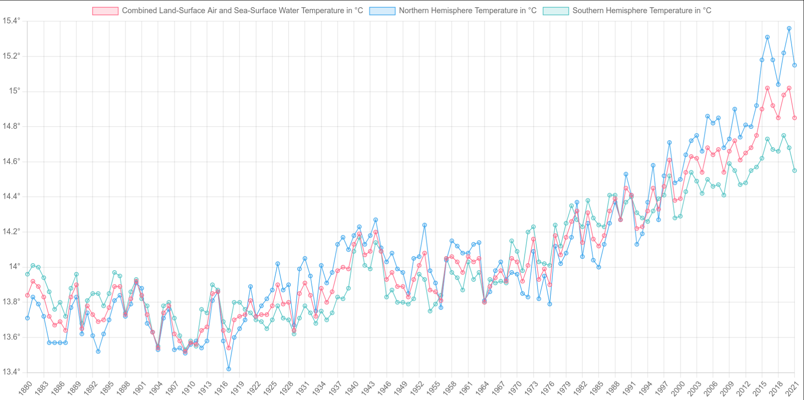

# Temperature-graph-api

This Web Page fetch the data from the local file in csv(comma-separated values), and put the data in a graph line format using a chart.js libary. 
This show the the data in 3 lines  
1.Combined Land-Surface Air and Sea-Surface Water Temperature in °C 
2.Northern Hemisphere Temperature in °C 
3.Southern Hemisphere Temperature in °C 

